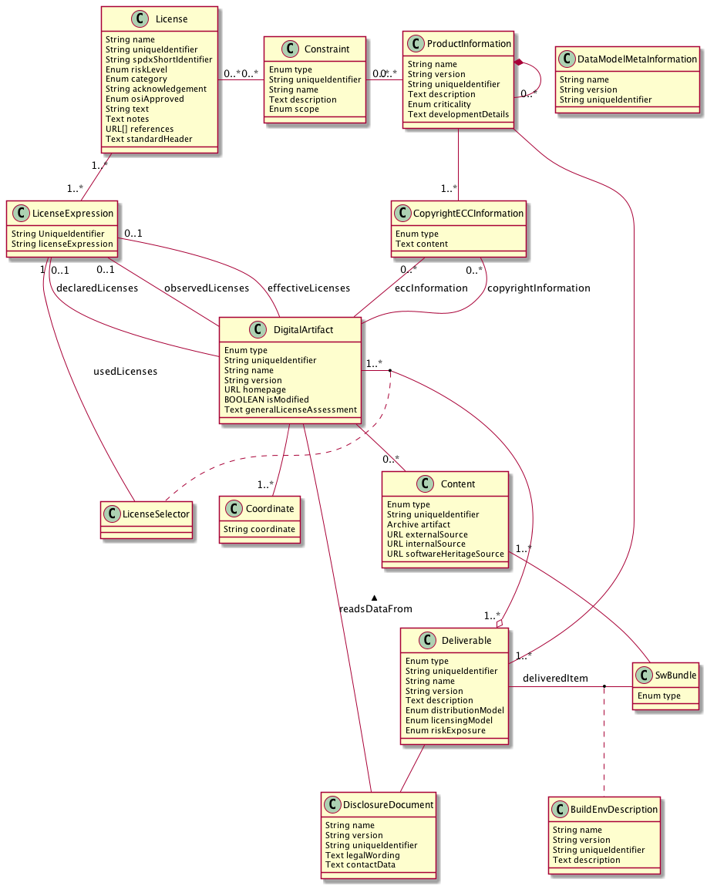

 
 
# Data Structures

Different kind of data are generated and consumed by the functional blocks, which comprise an end to end compliance tool chain. All data which have to be produced/exchanged/consumed are presented here. This does not mean that every functional block has to deal with all data. These data structures shall be regarded as the "final" collection of all needed data and the functional blocks consume and/or generate the subsets of data they are aware of. If a certain implementation of the functional blocks in a specific workflow identifies the need of further implementation specific data they can be added as "specific data".

## Build environment description
Sometimes a description of the build environment, which was used to build the software product, is required. This data type implements this. It is assumed that the description of the build environment qualifies a distinct deliverable. Like an embedded firmware image or a container(s) or simply a certain executable

## Content
This class is the representation of a certain piece of "software". It can be a binary package or a source package.

## Constraint
Contraints are requirements that have to be fulfilled. These are for example the obligations a license defines or constrains that products have to fulfill when they integrate other products. The design of an contstraint shall be in a way that a constraint can be defined in a specific company environment in accordance to the company specific poliy. On the other hand a constraint can also be made available via a publicly available resource. Besides a license or a product also ECC qualitication can define a certain constraint.

## CopyrightECCInformation
This is a representation of additional information like copyrights or ecc information

## DataModelMetaInformation
This is the meta information of the model itself, like name, version, etc.

## Deliverable
A deliverable implements a real deliverable of a product. A product can be made available in different formats, like as container(s), an executable, an image etc. The different options are modeled as deliverable

## Disclosure document
The disclosure document is often named as OSS declaration or OSS disclosure document or ReadME_OSS

## Digital Artifact
A digital artifact represents an distinct identifiable part of a product, i.e. an element of the bill of material. It can be an OSS pacakge, a commercial library, a cerain font, an icon, a picture, a called 3rd party service. Especially in case of mobile apps these artifacts have to be taken into account. In SPDX this is called a Package.

## Coordinates
This class represents the coordinates of a DigitalArtifact in a certain technology, i.e., the typical reference of a unique component version in this technology. E.g., maven coordinates for a component on maven central.

## LicenseExpression
Representation of a SPDX license expression that combines a set of licenses to the licenses expression attached to a DigitalArtifact

## LicenseSelector
Property of the usage of a DigitalArtifact in a Deliverable, used to express the used licenses in cases where a DigitalArtifact allows license selection.

## License
The license data model is based on the current SPDX definition of a license, the SPDX specification itself is licensed und CC-BY-3.0. The SPDX license definiton lacks from a compliance process point of view some data which are important to implement an integrated compliance workflow taking care of company specific requirements. This definition has the purpose to provide such abbtional data.

## ProductInformation
This data type defines is the meta information of a specific product. A product in this context can be everything a company makes available to 3rd parties. Note that a product can consist of other products, which may introduce certain constraints to the integrating product.

## SwBundle
This represents the real item which is made available to 3rd parties,e.g. it is the executable, which is made available to 3rd parties.

